# FlashCards

A console base C# application used to help with learning topics that require recollection, like languages. The user
will set up a set of virtual flash cards with a question on one side and an answer on the other.
Implemented using SQL Server and the Data Transfer Object pattern.

# How to use

This project requires the use of Microsoft SQL Server. There shouldn't be any requirement to use a specific type or
edition of SQL Server, however this was developed using the Linux container image:

``` powershell
docker pull mcr.microsoft.com/mssql/server
docker run -e "ACCEPT_EULA=Y" -e "MSSQL_SA_PASSWORD=yourStrong(!)Password" -p 1433:1433 -d mcr.microsoft.com/mssql/server
```

Which will then run the container using the default port, the developer edition, and (at the time of writing) the 2022
version of the software.

Once the project is built you'll need to update the configuration in the `Flashcards.dll.config` file to use your SQL
Server. During development the sa account was used. However, it should be possible to create a lower privilege account
as long as it can create a database and tables. You could also pre-create the `Flashcards` database and use an account
that can only create/use tables.

Once the application is able to connect to the database all interaction is provided via a menu.

There are three main components to the application. Stacks, cards, and sessions.

## Stacks

Stacks are stacks of cards to study from. If you have no stacks, you'll only be able to `Manage Stacks` from the menu.

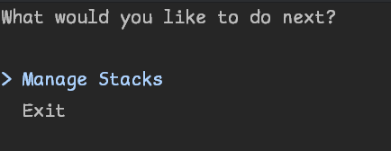

And then the option to Create a Stack:

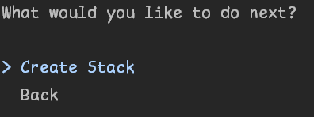

Once you have created a stack to work from you'll get additional options in the area:

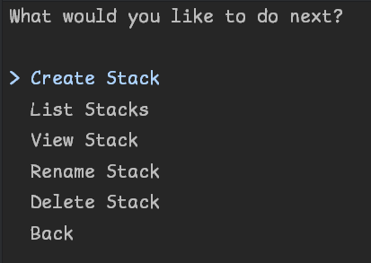

Should you wish to delete anything in the app, you'll be prompted to confirm that you wish to delete the stack:

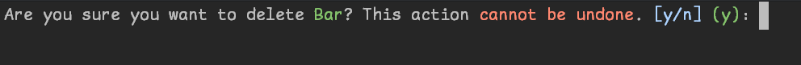

When you delete a stack, all cards and sessions go with it!

## Cards

Cards are the individual items to study. They come with a 'front' and a 'back'. In a study session you'll be shown the
front of a card and asked to enter the text that can be found on the back.

When initially entering the cards menu you'll be required to select a stack to manage cards from:

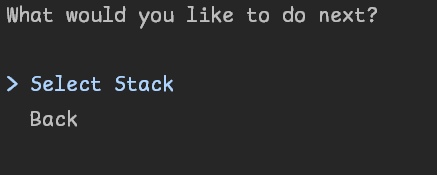

From there you'll be asked to create a card, much like in the stack menu.

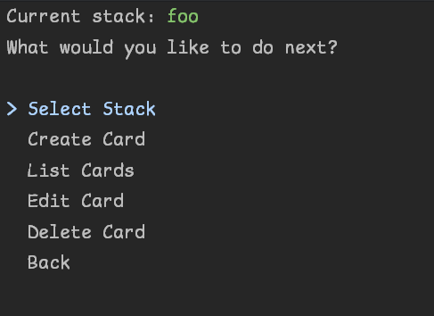

## Sessions

Sessions or Study Sessions are where you test yourself using your stacks of cards.

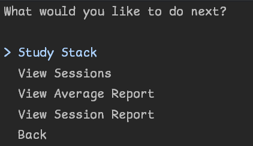

Selecting `Study Stack` will prompt you to select a stack to study from.

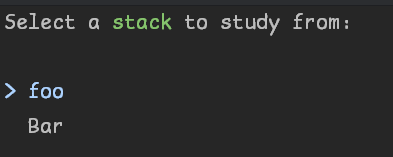

You'll then be shown cards from the session to test yourself with:

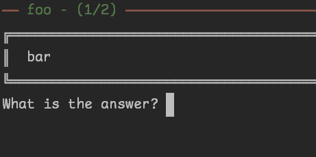

Whether correct or incorrect, you'll be shown the back of the card before moving on:

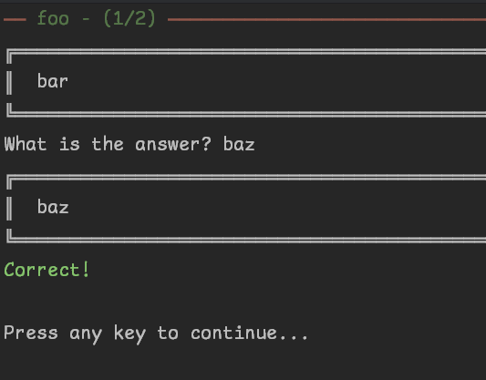

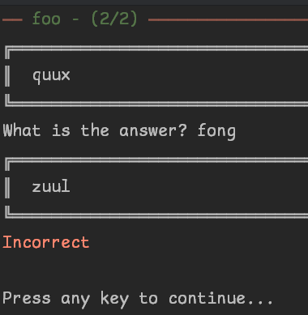

Once you have at least one session completed you'll get a variety of reporting options.

A simple list:

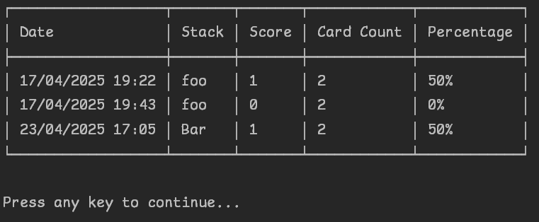

A session count report:

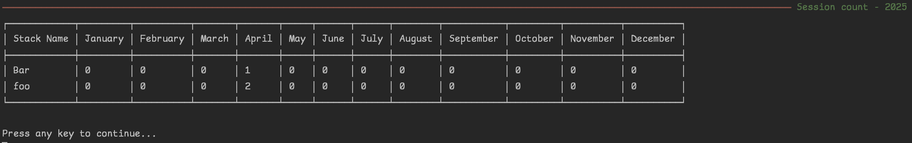

And an average score report:

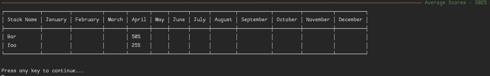


# Requirements

- [X] Allow users to create stacks of flashcards
- [X] Two tables, one for stacks and another for flashcards
  - [X] Tables are linked through foreign keys
- [X] Every flashcard MUST be a part of a stack
- [X] If a stack is deleted, the same should happen with the linked flashcards
- [X] Use DTOs to show the flashcards to the user without the id of the stack it belongs to
- [X] When showing a stack to the user, flashcard Ids should always start at 1 without any gaps between them
  - [X] If you have 10 cards and number 5 is deleted show Ids from 1 to 9.
- [X] After flash card functionality, create a "Study Session" area where the users will study the stacks
  - [X] All study sessions should be stored with date and score.
  - [X] The study and stack tables should be linked
    - [X] If a stack is deleted all its study sessions should also be deleted
- [X] The project should contain a call to the study table so that users can see all their study sessions
  - [X] Users should be able to view, but not update, or delete any study session   

## Stretch Goals

- [X] Report system
  - [X] Number of sessions per month per stack
  - [X] Average score per month per stack
- [ ] Sample data generation

# Features

- Backed by a SQL Server database to manage all details
  - Automatic database and table creation with correct permissions
- Interactive menu
- Automatic reporting functionality

# Challenges

Compared to the previous project there were significantly fewer challenges in this one. Docker is mostly a new world to
me so there was a bit of a learning curve there.  
I have used SQL Server to a degree in prior roles, so there was some familiarity there. However, the creation of 
databases and tables was new and so that took some time to get around the differences to SQLite.  
Likewise the Pivot command was entirely new and took some time to master.  
I think the DTO pattern makes sense, however this is a very simplistic implementation of it so there may be nuance I'm 
missing.  
My motivation was starting to wane towards the end of the project, so I didn't take on my stretch goal of sample data
generation. I've done this previously in-project with bogus, however I was hoping to come back and do this with the 
PowerShell SQL Server module. I probably should have just worked on this as I went along.

# Lessons Learned

- Docker is really useful!
- Develop tooling in line with features if you think it will make life easier
- A lot around the specifics of working with SQL Server and some of the T SQL syntax

# Areas to Improve

- Learn about the T SQL PowerShell utilities
- Work on more complex implementations of Data Transfer Objects

# Resources Used

- Microsoft T SQL docs
- Microsoft learn guide to getting started with SQL Server in C#
- W3Schools SQL docs (quicker to look up simpler things than the T SQL docs)
- Spectre.Console docs
- Dapper Docs
- Some Stack-Overflow for a couple of date related SQL cases
